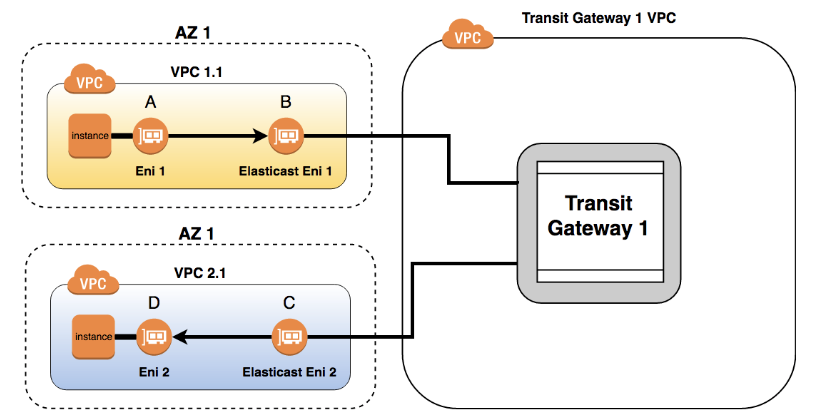
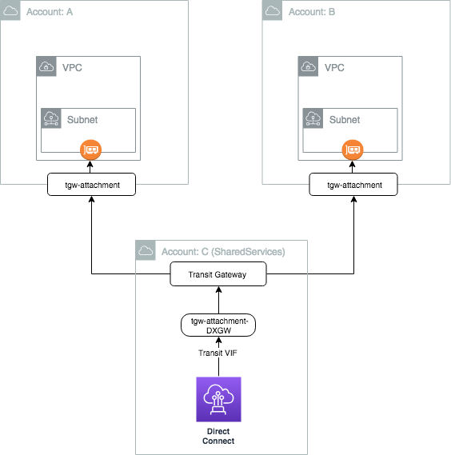

# Transit Gateway in a Multi-Account Deployment

The Transit GateWay (TGW) feature provides a managed virtual router for AWS VPC customers. Multiple VPCs, VPNs and DX Gateways can be attached to the TGW to perform IP routing between them. Multiple route tables can live inside a single TGW and be routed according to the customer business use case.

Transit Gateway Overview
------------------------

With Transit Gateway, customers can implement policies for how VPCs communicate with each other and with their on-premises networks. Transit Gateway gives customers the ability to simplify interconnectivity within their networks enabling them to scale workloads across a large number of VPCs and across accounts. While enabling connectivity at scale, Transit Gateway also provides stronger operational controls and improved security.

Fundamentally when you connect to a Transit Gateway with your VPC an elastic network interface (ENI) is created within the subnet that you specified. The ENI assumes an IP address from that subnet and the VPC route table can be updated to reflect the desired CIDR range to communicate across the TGW service. The below diagram represents the logical construct of the ENI insertion with a VPC.



AWS Resource Access Manager And Transit Gateway
-----------------------------------------------
In order to use TGW across multiple accounts you need to leverage AWS Resource Access Manager which grants you the ability to share selected resources across your Organization, OU unit or selected accounts.

Create the transit gateway in a central account. Using a central account like a shared services account or network account will provide a central location to manage common services used across your accounts.

```
AWSTemplateFormatVersion: 2010-09-09
Description: "TransitGateway: This template creates a network transit hub that interconnects attachments (VPCs and VPNs) within the same account or across accounts"
 
Resources:
  TransitGateway:
      Type: "AWS::EC2::TransitGateway"
      Properties:
        AmazonSideAsn: 64512
        AutoAcceptSharedAttachments: enable
        DefaultRouteTableAssociation: enable
        DefaultRouteTablePropagation: enable
        Description: Non-Production Transit Gateway Coordinator
        DnsSupport: enable
        VpnEcmpSupport: enable
        Tags:
          - Key: Name
            Value: Non-Prod Traffic Director
 
Outputs:
  MyStackName:
    Description: StackName
    Value: !Ref "AWS::StackName"
  TransitGateWayOutput:
    Description: The ID of the TransitGateway
    Value: !Ref TransitGateway
    Export:
      Name: !Sub ${AWS::StackName}-TransitGateway

```
Once the TGW is created enable AWS Resource Access Manager (RAM) to share the desired resource.

To enable sharing across the organization you first need to enable the feature. Alternatively you can enable automatic resource sharing when you add additional accounts to AWS Organizations using the command below.

```
aws ram enable-sharing-with-aws-organization --region ca-central-1
```

Create Resource Share Across Entire Organization
-------------------------------------------------

```
aws ram create-resource-share --name TransitGateway --resource-arn arn:aws:ec2:ca-central-1:<account#>:transit-gateway/tgw-xxxxxxxxxxxxxxxxx \
--principals arn:aws:organizations::<account#>:organization/<o-3axxxxxx> \
--tags key=Name,value=TransitGatewayRAM \
--region ca-central-1
```

Create Transit Gateway Attachment In Spoke Account
--------------------------------------------------
```
AWSTemplateFormatVersion: 2010-09-09
Description: "TransitGateway Attachment: When you attach a VPC to a transit gateway, you must specify one subnet from each Availability Zone to be used by the transit gateway to route traffic. Specifying one subnet from an Availability Zone enables traffic to reach resources in every subnet in that Availability Zone."
Metadata:
  AWS::CloudFormation::Interface:
    ParameterGroups:
      - Label:
          default: TGW-Attachment Configuration
        Parameters:
          - VPC
          - Subnet1
          - Subnet2
          - TransitGWStackName
    ParameterLabels:
      VPC
      Subnet1
      Subnet2
      TransitGWStackName


Parameters:
  VPC:
    Description: Choose which VPC you want the Transit Gateway to connect with.
    Type: AWS::EC2::VPC::Id
    ConstraintDescription: Must be the VPC Id of an existing Virtual Private Cloud
  
  Subnet1:
    Description: Choose which Subnet you would like Transit Gateway to connect too.
    Type: AWS::EC2::Subnet::Id
    ConstraintDescription: Must be a list of at least two existing subnets associated with at least
      two different availability zones. They should be residing in the selected VPC.

  Subnet2:
    Description: Choose which Subnet you would like Transit Gateway to connect too.
    Type: AWS::EC2::Subnet::Id
    ConstraintDescription: Must be a list of at least two existing subnets associated with at least
      two different availability zones. They should be residing in the selected VPC.
  
  TransitGWStackName:
    Description: The name of the stack that exports the values for the transit gateway ID.
    Type: String
    Default: TGW-TransitGateway

#Mappings: 

#Conditions: 

Resources: 
  TransitGatewayAttachment:
    Type: "AWS::EC2::TransitGatewayAttachment"
    Properties:
      SubnetIds: 
        - !Ref Subnet1
        - !Ref Subnet2
      Tags: 
        - Key: Name
          Value: tgw-attachment-delete
      TransitGatewayId: 
        Fn::ImportValue: !Sub '${TransitGWStackName}-TransitGateway'
      VpcId: !Ref VPC

Outputs:
  MyStackName:
    Description: StackName
    Value: !Ref "AWS::StackName"
  TransitGateWayAttachment:
    Description: The TransitGateway attachment ID
    Value: !Ref TransitGatewayAttachment
```
Transit Gateway with DXGW
--------------------------
Currently the Direct Connect Gateway (DXGW) can connect a DX virtual interface to multiple VPC's in the same account and that account only. With the introduction of RAM and TGW you can connect to all your accounts and VPC's across the region and on-premise with DXGW attachment. The illustration below presents a high-level overview of the construct.




